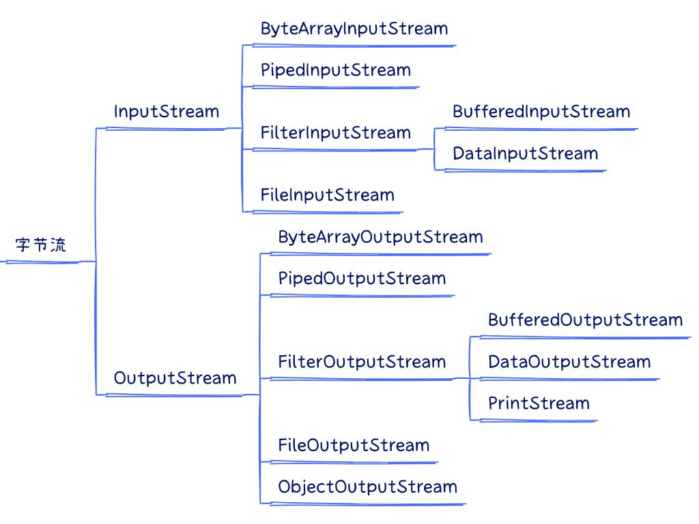
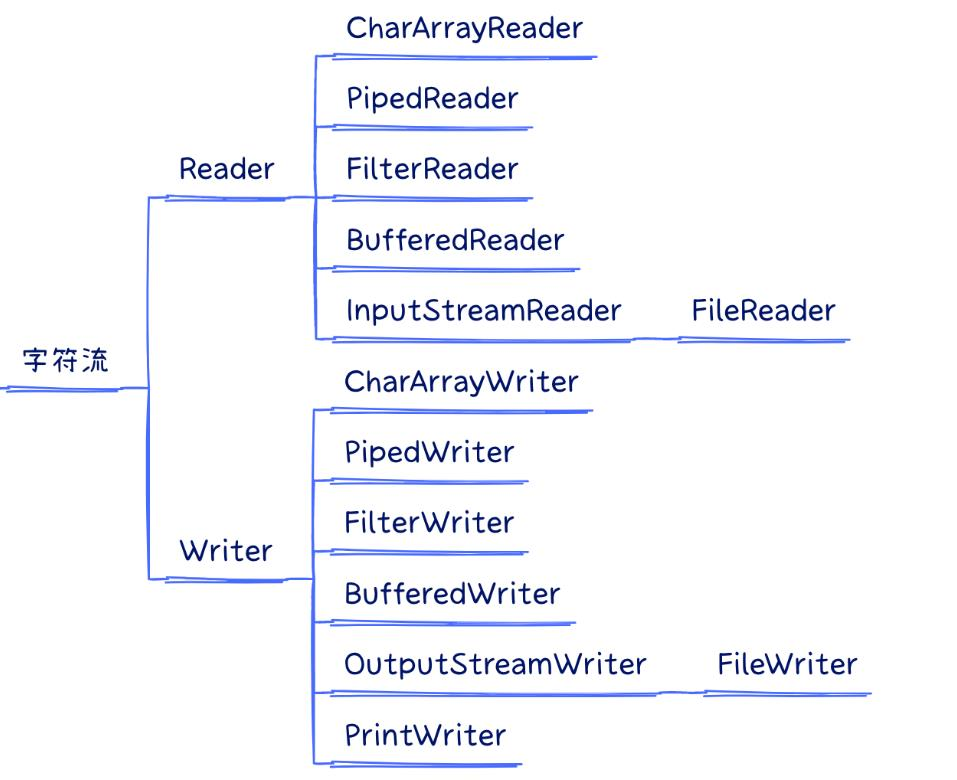

# Java IO 分类

## 以传输方式分类

以传输方式分类可以将 IO 流分为：字节流、字符流。

- 字节流读取单个字节，字符流读取单个字符(一个字符根据编码的不同，对应的字节也不同，如 UTF-8 编码中文汉字是 3 个字节，GBK编码中文汉字是 2 个字节。)
- 字节流用来处理二进制文件(图片、MP3、视频文件)，字符流用来处理文本文件(可以看做是特殊的二进制文件，使用了某种编码，人可以阅读)。

简而言之，字节是给计算机看的，字符才是给人看的

### 字节流

以抽象类 `InputStream` 和 `OutputStream` 往下分为输入流和输出流，输入流和输出流大多一一对应。



### 字符流

以抽象类 `Reader` 和 `Writer` 往下分为输入流和输入流，输入流和输出流大多一一对应。



### 字节转字符流

`InputStreamReader / OutputStreamWriter`，用来实现将字节流转换为字符流。

```java
try (
        FileInputStream is = new FileInputStream("file");
        FileOutputStream os = new FileOutputStream("file");
) {
    // 字节输入流 --> 字符输入流
    BufferedReader br = new BufferedReader(new InputStreamReader(is));
    
    // 字节输出流 --> 字符输出流
    BufferedWriter bw = new BufferedWriter(new OutputStreamWriter(os));
} catch (FileNotFoundException e) {
    throw new RuntimeException(e);
}
```

## 以数据操作分类

1. 文件操作：FileInputStream、FileOutputStream、FileReader、FileWriter
2. 数组操作：ByteArrayInputStream、ByteArrayOutputStream、CharArrayReader、CharArrayWriter
3. 管道操作：PipedInputStream、PipedOutputStream、PipedReader、PipedWriter
4. 基本数据类型操作：DataInputStream、DataOutputStream
5. 缓冲操作：BufferedInputStream、BufferedOutputStream、BufferedReader、BufferedWriter
6. 打印操作：PrintStream、PrintWriter
7. 序列化操作：ObjectInputStream、ObjectOutputStream
8. 转换操作：InputStreamReader、OutputStreamWriter

## 随机访问流 RandomAccessFile

1. RandomAccessFile(String name,String mode) name用来确定文件，mode取r(读)或rw(可读写)，通过mode可以确定流对文件的访问权限。
2. seek(long a)用来定位流对象读写文件的位置，a确定读写位置距离文件开头的字节个数。
3. getFilePointer()获得流的当前读写位置。

"r"    以只读方式打开。调用结果对象的任何 write 方法都将导致抛出 IOException。  
"rw"   打开以便读取和写入。
"rws"  打开以便读取和写入。相对于 "rw"，"rws" 还要求对“文件的内容”或“元数据”的每个更新都同步写入到基础存储设备。  
"rwd"  打开以便读取和写入，相对于 "rw"，"rwd" 还要求对“文件的内容”的每个更新都同步写入到基础存储设备。

> 参考：[java io系列26之 RandomAccessFile](https://www.cnblogs.com/skywang12345/p/io_26.html)

# Paths、Files 工具类

## Paths

jdk7 引入了 Path 和 Paths 类

- Path 用来表示文件路径
- Paths 是工具类，用来获取 Path 实例

```java 
Path path = Paths.get("d:\\data\\projects\\a\\..\\b");
System.out.println(path);
System.out.println(path.normalize()); // 正常化路径

// 输出：
// d:\data\projects\a\..\b
// d:\data\projects\b
```

## Files

### 检查文件是否存在：

```java 
Path path = Paths.get("helloword/data.txt");
System.out.println(Files.exists(path));
```

### 创建目录：

```java 
// 创建一级目录，如果目录已存在，会抛异常 FileAlreadyExistsException
Path path = Paths.get("helloword/d1");
Files.createDirectory(path);

// 创建多级目录
Path path = Paths.get("helloword/d1/d2");
Files.createDirectories(path);
```

如果目录已存在，会抛异常 FileAlreadyExistsException

### 拷贝文件：

```java 
Path source = Paths.get("helloword/data.txt");
Path target = Paths.get("helloword/target.txt");

// 普通拷贝，如果文件已存在，会抛异常 FileAlreadyExistsException
Files.copy(source, target);

// 覆盖拷贝
Files.copy(source, target, StandardCopyOption.REPLACE_EXISTING);
```

### 移动文件：

```java 
Path source = Paths.get("helloword/data.txt");
Path target = Paths.get("helloword/data.txt");

// StandardCopyOption.ATOMIC_MOVE 保证文件移动的原子性
Files.move(source, target, StandardCopyOption.ATOMIC_MOVE);
```

### 删除文件：

```java 
Path target = Paths.get("helloword/target.txt");

// 如果文件不存在，会抛异常 NoSuchFileException
Files.delete(target);
```

### 删除目录：

```java 
Path target = Paths.get("helloword/d1");

// 如果目录还有内容，会抛异常 DirectoryNotEmptyException
Files.delete(target);
```

### 遍历目录：

```java
public static void main(String[] args) throws IOException {
    Path path = Paths.get("C:\\Program Files\\Java\\jdk1.8.0_91");
    AtomicInteger dirCount = new AtomicInteger();
    AtomicInteger fileCount = new AtomicInteger();
    Files.walkFileTree(path, new SimpleFileVisitor<Path>(){
        @Override
        public FileVisitResult preVisitDirectory(Path dir, BasicFileAttributes attrs) 
            throws IOException {
            System.out.println(dir);
            dirCount.incrementAndGet();
            return super.preVisitDirectory(dir, attrs);
        }

        @Override
        public FileVisitResult visitFile(Path file, BasicFileAttributes attrs) 
            throws IOException {
            System.out.println(file);
            fileCount.incrementAndGet();
            return super.visitFile(file, attrs);
        }
    });
    System.out.println(dirCount);
    System.out.println(fileCount);
}
```
