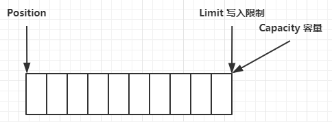

# Buffer

> **非线程安全**

包括以下类型：

- ByteBuffer
- CharBuffer
- ShortBuffer
- IntBuffer
- LongBuffer
- FloatBuffer
- DoubleBuffer

## 缓冲区状态变量

- capacity：容量
- position：位置，当前操作的位置指针
- limit：限制，当前操作范围

初始位置：



写模式，写入4个字节：


读模式，flip 动作：


读取4个字节之后：


clear 动作，重置到初始状态


compact 动作，把未读完的部分向前压缩，然后切换至写模式


## 常见方法

### 分配空间：

```java
// 分配堆内空间
Bytebuffer buf = ByteBuffer.allocate(16);
// 分配直接内存
Bytebuffer buf = ByteBuffer.allocateDirect(16);
```

### 写入数据：

```java
// Channel::read()
int readBytes = channel.read(buf);
// Buffer::put()
buf.put((byte)127);
```

### 读取数据：

```java
// Channel::write()
int writeBytes = channel.write(buf);
// Buffer::get()
byte b = buf.get();
```

get 方法会让 position 读指针向后走，如果想重复读取数据

- 可以调用 `rewind` 方法将 `position` 重新置为 0
- 或者调用 `get(int i)` 方法获取索引 `i` 的内容，它不会移动读指针

### mark、reset：

> - rewind 方法的增强。
> - mark 是在读取时，做一个标记，即使 position 改变，只要调用 reset 就能回到 mark 的位置。
> - 注意：rewind 和 flip 都会清除 mark 位置

## 字符串与 ByteBuffer 互相转换：

```java
ByteBuffer buffer1 = StandardCharsets.UTF_8.encode("你好");
ByteBuffer buffer2 = Charset.forName("utf-8").encode("你好");

debug(buffer1);
debug(buffer2);

CharBuffer buffer3 = StandardCharsets.UTF_8.decode(buffer1);
System.out.println(buffer3.getClass());
System.out.println(buffer3.toString());
```

# Channel

## FileChannel

> FileChannel 只能工作在阻塞模式下

### 获取

不能直接打开 FileChannel，必须通过 FileInputStream、FileOutputStream 或者 RandomAccessFile 来获取 FileChannel，它们都有 getChannel 方法

- 通过 FileInputStream 获取的 channel 只能读
- 通过 FileOutputStream 获取的 channel 只能写
- 通过 RandomAccessFile 是否能读写根据构造 RandomAccessFile 时的读写模式决定

### 读取

从 channel 读取数据填充 ByteBuffer，返回值表示读到了多少字节，-1 表示到达了文件的末尾

```java
int readBytes = channel.read(buffer);
```

### 写入

```java
ByteBuffer buffer = ...;
buffer.put(...); // 存入数据
buffer.flip();   // 切换读模式

while(buffer.hasRemaining()) {
    channel.write(buffer);
}
```

在 while 中调用 channel.write 是因为 write 方法并不能保证一次将 buffer 中的内容全部写入 channel

### 关闭

channel 必须关闭，不过调用了 FileInputStream、FileOutputStream 或者 RandomAccessFile 的 close 方法会间接地调用 channel 的 close 方法

### 位置

```java
// 获取当前位置
long pos = channel.position();

// 设置当前位置
channel.position(newPos);
```

> 注意：设置当前位置时，如果设置为文件的末尾
> - 这时读取会返回 -1
> - 这时写入，会追加内容，但要注意如果 position 超过了文件末尾，再写入时在新内容和原末尾之间会有空洞（00）

### 大小

size() 方法可以获取文件大小

### 强制写入

操作系统出于性能的考虑，会将数据缓存，不是立刻写入磁盘。可以调用 force(true) 方法将文件内容和元数据（文件的权限等信息）立刻写入磁盘

### 演示拷贝文件：

```java
String FROM = "helloword/data.txt";
String TO = "helloword/to.txt";
long start = System.nanoTime();
try (FileChannel from = new FileInputStream(FROM).getChannel();
     FileChannel to = new FileOutputStream(TO).getChannel()) {
    from.transferTo(0, from.size(), to);
} catch (IOException e) {
    e.printStackTrace();
}
long end = System.nanoTime();
System.out.println("transferTo 用时：" + (end - start) / 1000_000.0);
```

### 演示大文件传输（超过 2g）

```java
public class TestFileChannelTransferTo {
    public static void main(String[] args) {
        try (FileChannel from = new FileInputStream("data.txt").getChannel();
             FileChannel to = new FileOutputStream("to.txt").getChannel()) {
            // 效率高，底层会利用操作系统的零拷贝进行优化
            long size = from.size();
            // left 变量代表还剩余多少字节
            for (long left = size; left > 0; ) {
                System.out.println("position:" + (size - left) + " left:" + left);
                left -= from.transferTo((size - left), left, to);
            }
        } catch (IOException e) {
            e.printStackTrace();
        }
    }
}
```

# Selector


## select 何时返回

- 事件发生时
    - 客户端发起连接请求，会触发 accept 事件
    - 客户端发送数据过来，客户端正常、异常关闭时，都会触发 read 事件，另外如果发送的数据大于 buffer 缓冲区，会触发多次读取事件
    - channel 可写，会触发 write 事件
    - 在 linux 下 nio bug 发生时
- 调用 selector.wakeup()
- 调用 selector.close()
- selector 所在线程 interrupt

## 多线程下 Selector 的操作

使用多线程优化 NIO 在一开始会很自然的想到使用一个 Selector 监听所有的请求，之后再把请求分发给各个线程去执行，但是 Selector 的执行机制在事件未处理完成之前会一直轮询该事件，导致一个事件被多次执行。

解决方式就是每个线程持有一个 Selector，主线程的 Selector 负责建立连接，连接建立成功之后将该 SocketChannel 委托给一个工作线程的 Selector 去监听处理。

