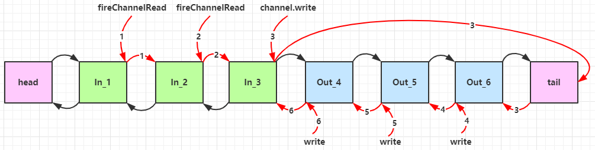

# EventLoop 接口

> 事件循环对象，本质是一个单线程执行器（同时维护了一个 Selector），里面有 run 方法处理 Channel 上源源不断的 io 事件。

## EventLoopGroup 接口

> 是一组 EventLoop，Channel 一般会调用 EventLoopGroup 的 register 方法来绑定其中一个 EventLoop，后续这个 Channel 上的 io 事件都由此 EventLoop 来处理（保证了 io 事件处理时的线程安全）

```java
DefaultEventLoopGroup group = new DefaultEventLoopGroup(2);
System.out.println(group.next()); // io.netty.channel.DefaultEventLoop@38082d64
System.out.println(group.next()); // io.netty.channel.DefaultEventLoop@dfd3711
System.out.println(group.next()); // io.netty.channel.DefaultEventLoop@38082d64 
System.out.println(group.next()); // io.netty.channel.DefaultEventLoop@dfd3711 
```

## 关闭：shutdownGracefully

优雅关闭 `shutdownGracefully` 方法。
该方法会首先切换 `EventLoopGroup` 到关闭状态从而拒绝新的任务的加入，然后在任务队列的任务都处理完成后，停止线程的运行。
从而确保整体应用是在正常有序的状态下退出的。

## NioEventLoopGroup

会将线程和对应的 SocketChannel 绑定起来

```java
// 服务端可以指定事件循环组
.addLast(new NioEventLoopGroup(), "myHandler", new ChannelInboundHandlerAdapter() {

});
```

## DefaultEventLoopGroup

普通轮询任务

# Channel

## ChannelFuture

利用 ChannelFuture 才可以获取到 Channel 对象

```java
final ChannelFuture channelFuture = new Bootstrap()
        .group(new NioEventLoopGroup())
        .channel(NioSocketChannel.class)
        .handler(new ChannelInitializer<NioSocketChannel>() {
            @Override
            protected void initChannel(NioSocketChannel channel) throws Exception {
                channel.pipeline().addLast(new StringEncoder());
            }
        })
        .connect("localhost", 977);

channelFuture.sync().channel().writeAndFlush("Hello World. ");
```

因为 connect 是异步方法，所以需要调用 sync 阻塞当前线程等待 connect 返回，才可以获取到 channel 对象。

如果不想阻塞当前线程执行还可以使用回调的方式获取 channel 对象：

```java
channelFuture.addListener((ChannelFutureListener) future -> {
    future.channel().writeAndFlush("Hello, World");
});
```

## CloseFuture

```java
// 获取 CloseFuture 对象
ChannelFuture closeFuture = channel.closeFuture();

// 1：同步处理关闭，阻塞当前线程，等待 channel 关闭
log.debug("waiting close...");
closeFuture.sync();
log.debug("处理关闭之后的操作");
        
// 2：异步处理关闭
closeFuture.addListener(new ChannelFutureListener() {
    @Override
    public void operationComplete(ChannelFuture future) throws Exception {
        log.debug("处理关闭之后的操作");
        group.shutdownGracefully();
    }
});
```

# Future & Promise

- JDK 中的 Future：java.util.concurrent.Future
- Netty 中的 Future：io.netty.util.concurrent.Future
- Promise：io.netty.util.concurrent.Promise

Netty 的 Future 继承自 JDK 的 Future，而 Promise 又对 Netty Future 进行了扩展

- jdk Future 只能同步等待任务结束（或成功、或失败）才能得到结果
- netty Future 可以同步等待任务结束得到结果，也可以异步方式得到结果，但都是要等任务结束
- netty Promise 不仅有 netty Future 的功能，而且脱离了任务独立存在，只作为两个线程间传递结果的容器

## 方法介绍

| 功能/名称       | jdk Future      | netty Future                          | Promise |
|-------------|-----------------|---------------------------------------|---------|
| cancel      | 取消任务            | -                                     | -       |
| isCanceled  | 任务是否取消          | -                                     | -       |
| isDone      | 任务是否完成，不能区分成功失败 | -                                     | -       |
| get         | 获取任务结果，阻塞等待     | -                                     | -       |
| getNow      | -               | 获取任务结果，非阻塞，还未产生结果时返回 null             | -       |
| await       | -               | 等待任务结束，如果任务失败，不会抛异常，而是通过 isSuccess 判断 | -       |
| sync        | -               | 等待任务结束，如果任务失败，抛出异常                    | -       |
| isSuccess   | -               | 判断任务是否成功                              | -       |
| cause       | -               | 获取失败信息，非阻塞，如果没有失败，返回null              | -       |
| addListener | -               | 添加回调，异步接收结果                           | -       |
| setSuccess  | -               | -                                     | 设置成功结果  |
| setFailure  | -               | -                                     | 设置失败结果  |

## Promise 使用示例

> 相当于是一个结果容器，与 Future 最大的区别就是可以主动创建 Promise 对象

```java
public static void main(String[] args) throws ExecutionException, InterruptedException {
    // 1. 准备 EventLoop 对象
    EventLoop eventLoop = new NioEventLoopGroup().next();
    // 2. 可以主动创建 promise, 结果容器
    DefaultPromise<Integer> promise = new DefaultPromise<>(eventLoop);
    new Thread(() -> {
        // 3. 任意一个线程执行计算，计算完毕后向 promise 填充结果
        log.debug("开始计算...");
        try {
            int i = 1 / 0;
            Thread.sleep(1000);
            promise.setSuccess(80);
        } catch (Exception e) {
            e.printStackTrace();
            promise.setFailure(e);
        }

    }).start();
    // 4. 接收结果的线程
    log.debug("等待结果...");
    log.debug("结果是: {}", promise.get());
}
```

# Handler & Pipeline

ChannelHandler 用来处理 Channel 上的各种事件，分为入站、出站两种。所有 ChannelHandler 被连成一串，就是 Pipeline

- **入站处理器**通常是 ChannelInboundHandlerAdapter 的子类，主要用来读取客户端数据，写回结果
- **出站处理器**通常是 ChannelOutboundHandlerAdapter 的子类，主要对写回结果进行加工

Pipeline 中会有两个默认的处理器：head、tail，入站处理器从 head 节点往后执行，出站处理器从 tail 节点往前执行

`ctx.channel().write(msg)` & `ctx.write(msg)` 都是触发出站处理器的执行

- `ctx.channel().write(msg)` 从尾部开始查找出站处理器
- `ctx.write(msg)` 是从当前节点找上一个出站处理器



# ByteBuf

## 创建

```java
// 普通创建
ByteBuf buffer = ByteBufAllocator.DEFAULT.buffer(10);

// 堆内存创建
ByteBuf buffer = ByteBufAllocator.DEFAULT.heapBuffer(10);

// 直接内存创建
ByteBuf buffer = ByteBufAllocator.DEFAULT.directBuffer(10);

// 通过 ChannelHandlerContext 对象创建（推荐）
ByteBuf buf = ctx.alloc().buffer();
```

## 结构

ByteBuf 分别拥有读指针和写指针，不需要像 ByteBuffer 一样切换读写模式，刚创建出来时读写指针都是 0


## 池化

池化的最大意义在于可以重用 ByteBuf，优点有

- 没有池化，则每次都得创建新的 ByteBuf 实例，这个操作对直接内存代价昂贵，就算是堆内存，也会增加 GC 压力
- 有了池化，则可以重用池中 ByteBuf 实例，并且采用了与 jemalloc 类似的内存分配算法提升分配效率
- 高并发时，池化功能更节约内存，减少内存溢出的可能

池化功能是否开启，可以通过下面的系统环境变量来设置

```java
-Dio.netty.allocator.type={unpooled|pooled}
```

## 读写

**写入：**

| 方法签名                                                          | 含义                  | 备注                                    |
|---------------------------------------------------------------|---------------------|---------------------------------------|
| writeBoolean(boolean value)                                   | 写入 boolean 值        | 用一字节 01\                              |00 代表 true\|false            |
| writeByte(int value)                                          | 写入 byte 值           |                                       |
| writeShort(int value)                                         | 写入 short 值          |                                       |
| writeInt(int value)                                           | 写入 int 值            | Big Endian，即 0x250，写入后 00 00 02 50    |
| writeIntLE(int value)                                         | 写入 int 值            | Little Endian，即 0x250，写入后 50 02 00 00 |
| writeLong(long value)                                         | 写入 long 值           |                                       |
| writeChar(int value)                                          | 写入 char 值           |                                       |
| writeFloat(float value)                                       | 写入 float 值          |                                       |
| writeDouble(double value)                                     | 写入 double 值         |                                       |
| writeBytes(ByteBuf src)                                       | 写入 netty 的 ByteBuf  |                                       |
| writeBytes(byte[] src)                                        | 写入 byte[]           |                                       |
| writeBytes(ByteBuffer src)                                    | 写入 nio 的 ByteBuffer |                                       |
| int writeCharSequence(CharSequence sequence, Charset charset) | 写入字符串               |                                       |

> 注意：
> - 这些方法的未指明返回值的，其返回值都是 ByteBuf，意味着可以链式调用
> - 网络传输，默认习惯是 Big Endian
> - 还有一类方法是 set 开头的一系列方法，也可以写入数据，但不会改变写指针位置

**读取：**

read 开头的方法会移动读取指针，get 开头的方法则不会移动读取指针
如果要重复读取可以使用标记方法配合：markReaderIndex 方法标记当前指针位置，resetReaderIndex 定位读取指针到标记位置

## 扩容

- 如何写入后数据大小未超过 512，则选择下一个 16 的整数倍，例如写入后大小为 12 ，则扩容后 capacity 是 16
- 如果写入后数据大小超过 512，则选择下一个 2^n，例如写入后大小为 513，则扩容后 capacity 是 2^10=1024（2^9=512 已经不够了）
- 扩容不能超过 max capacity 会报错

## 释放

堆外内存需要手动回收，Netty 使用的是`引用计数法`来回收 ByteBuf 的内存

- retain方法：使引用计数 +1
- release方法：使引用计数 -1

> 因为 pipeline 的存在，一般需要将 ByteBuf 传递给下一个 ChannelHandler，如果在前面 release 了，就失去了传递性  
> 当然，如果在这个 ChannelHandler 内这个 ByteBuf 已完成了它的使命，那么便无须再传递

**释放时机分析：**

- 入站 ByteBuf 处理原则
    - 对原始 ByteBuf 不做处理，调用 ctx.fireChannelRead(msg) 向后传递，这时无须 release
    - 将原始 ByteBuf 转换为其它类型的 Java 对象，这时 ByteBuf 就没用了，必须 release
    - 如果不调用 ctx.fireChannelRead(msg) 向后传递，那么也必须 release
    - 注意各种异常，如果 ByteBuf 没有成功传递到下一个 ChannelHandler，必须 release
    - 假设消息一直向后传，那么 TailContext 会负责释放未处理消息（原始的 ByteBuf）
- 出站 ByteBuf 处理原则
    - 出站消息最终都会转为 ByteBuf 输出，一直向前传，由 HeadContext flush 后 release
- 异常处理原则
    - 有时候不清楚 ByteBuf 被引用了多少次，但又必须彻底释放，可以循环调用 release 直到返回 true

## slice

> - ByteBuf::slice
> - 对原始 ByteBuf 进行切片成多个 ByteBuf，切片后的 ByteBuf 并没有发生内存复制，
> - 还是使用原始 ByteBuf 的内存，切片后的 ByteBuf 维护独立的 read，write 指针


## duplicate

> - ByteBuf::duplicate
> - 截取了原始 ByteBuf 所有内容，并且没有 max capacity 的限制，
> - 也是与原始 ByteBuf 使用同一块底层内存，只是读写指针是独立的


**copy方法：**会将底层内存数据进行深拷贝，因此无论读写，都与原始 ByteBuf 无关

## CompositeByteBuf

> 可以将多个 ByteBuf 合并为一个逻辑上的 ByteBuf，避免拷贝，底层还是共享同一块内存空间

```java
ByteBuf buf1 = ByteBufAllocator.DEFAULT.buffer(5);
buf1.writeBytes(new byte[]{1, 2, 3, 4, 5});
ByteBuf buf2 = ByteBufAllocator.DEFAULT.buffer(5);
buf2.writeBytes(new byte[]{6, 7, 8, 9, 10});

CompositeByteBuf buf3 = ByteBufAllocator.DEFAULT.compositeBuffer();
buf3.addComponents(true, buf1, buf2);
// true 表示增加新的 ByteBuf 自动递增 write index, 否则 write index 会始终为 0
```

