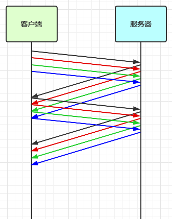

# 粘包、半包

## 粘包现象：

**现象：** 发送 abc def，接收 abcdef

**原因：**

- 应用层：接收方 ByteBuf 设置太大，Netty 默认 1024
- 滑动窗口：假设发送方 256 bytes 表示一个完整报文，但由于接收方处理不及时且窗口大小足够大，这 256 bytes 字节就会缓冲在接收方的滑动窗口中，当滑动窗口中缓冲了多个报文就会粘包
- Nagle 算法：TCP为了提高网络利用率，会进行延迟发送，导致粘包

## 半包现象：

**现象：** 发送 abcdef 接收 abc def

**原因：**

- 应用层：接收方 ByteBuf 小于实际发送数据量
- 滑动窗口：假设接收方的窗口只剩了 128 bytes，发送方的报文大小是 256 bytes，这时放不下了，只能先发送前 128 bytes，等待 ack 后才能发送剩余部分，这就造成了半包
- MSS 限制：当发送的数据超过 MSS 限制后，会将数据切分发送，就会造成半包

## 本质

> 本质是因为 TCP 是流式协议，消息无边界。

### 滑动窗口

TCP 以一个段（segment）为单位，每发送一个段就需要进行一次确认应答（ack）处理，但如果这么做，缺点是包的往返时间越长性能就越差

为了解决此问题，引入了窗口概念，窗口大小即决定了无需等待应答而可以继续发送的数据最大值

窗口实际就起到一个缓冲区的作用，同时也能起到流量控制的作用
  - 图中深色的部分即要发送的数据，高亮的部分即窗口
  - 窗口内的数据才允许被发送，当应答未到达前，窗口必须停止滑动
  - 如果 1001~2000 这个段的数据 ack 回来了，窗口就可以向前滑动
  - 接收方也会维护一个窗口，只有落在窗口内的数据才能允许接收

### MSS 限制

- 链路层对一次能够发送的最大数据有限制，这个限制称之为 MTU（maximum transmission unit），不同的链路设备的 MTU 值也有所不同，例如

    - 以太网的 MTU 是 1500
    - FDDI（光纤分布式数据接口）的 MTU 是 4352
    - 本地回环地址的 MTU 是 65535 - 本地测试不走网卡

- MSS 是最大段长度（maximum segment size），它是 MTU 刨去 tcp 头和 ip 头后剩余能够作为数据传输的字节数

    - ipv4 tcp 头占用 20 bytes，ip 头占用 20 bytes，因此以太网 MSS 的值为 1500 - 40 = 1460
    - TCP 在传递大量数据时，会按照 MSS 大小将数据进行分割发送
    - MSS 的值在三次握手时通知对方自己 MSS 的值，然后在两者之间选择一个小值作为 MSS

### Nagle 算法

- 即使发送一个字节，也需要加入 tcp 头和 ip 头，也就是总字节数会使用 41 bytes，非常不经济。因此为了提高网络利用率，tcp 希望尽可能发送足够大的数据，这就是 Nagle 算法产生的缘由
- 该算法是指发送端即使还有应该发送的数据，但如果这部分数据很少的话，则进行延迟发送
    - 如果 SO_SNDBUF 的数据达到 MSS，则需要发送
    - 如果 SO_SNDBUF 中含有 FIN（表示需要连接关闭）这时将剩余数据发送，再关闭
    - 如果 TCP_NODELAY = true，则需要发送
    - 已发送的数据都收到 ack 时，则需要发送
    - 上述条件不满足，但发生超时（一般为 200ms）则需要发送
    - 除上述情况，延迟发送

## 解决方案

1. 短连接：发一个包建立一次连接，这样连接的建立与断开就是消息的边界。缺点是效率太低
2. 消息固定长度（FixedLengthFrameDecoder）：每条消息固定长度，缺点是浪费空间
3. 消息使用分隔符隔离（LineBasedFrameDecoder），缺点是需要转义，实现比较麻烦，   
默认以 `\n` 或 `\r\n` 作为分隔符，如果超出指定长度仍未出现分隔符，则抛出异常
4. 为每条消息设置消息头与消息体，在消息头中表示消息长度（LengthFieldBasedFrameDecoder，推荐）  

### LengthFieldBasedFrameDecoder 构造器参数说明

- **maxFrameLength：**包的最大长度
- **lengthFieldOffset：**长度域的偏移量
- **lengthFieldLength：**长度域的包体长度
- **lengthAdjustment：**读取完长度域之后再加上或减少多少个字节开始拆包
- **initialBytesToStrip：**忽略多少个字节数，可以用来忽略包头，直接读取消息体

# 自定义协议

客户端和服务端定好共同的网络协议，之后按照协议解析消息处理

**协议设计要素：**

- 魔数，用来在第一时间判定是否是无效数据包
- 版本号，可以支持协议的升级
- 序列化算法，消息正文到底采用哪种序列化反序列化方式，可以由此扩展，例如：json、protobuf、hessian、jdk
- 指令类型，是登录、注册、单聊、群聊... 跟业务相关
- 请求序号，为了双工通信，提供异步能力
- 正文长度
- 消息正文