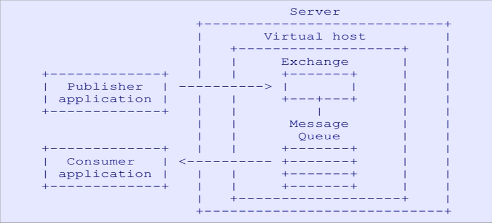

> cool.wrp.rabbirmq.simpledemo 包下的代码是没有 Spring 支持的。

# 搭建步骤

1. 修改 application.yml 中 spring.rabbitmq 配置
2. RabbirmqApplicationTests 中的测试方法将扮演的是生产者的角色
3. cool.wrp.rabbirmq.springdemo 包扮演消费者的角色
4. 启动 RabbirmqApplication 之后将自动监听队列中的消息

# AMQP 概念简介

1. **Server：** 又称 Broker，接受客户端的连接，实现 AMQP 实体服务
2. **Connection：** 连接，应用程序与 Broker 的网络连接
3. **Channel：** 网络信道，几乎所有的操作都在 Channel 中进行，Channel 是进行消息读写的通道。客户端可建立多个 Channel，每个 Channel 代表一个会话任务。
4. **Message：** 消息，服务器和应用程序之间传送的数据，由 Properties 和 Body 组成。Properties 可以对消息进行修饰，比如消息的优先级、延迟等高级特性；Body 则就是消息体内容。
5. **Virtual Host：** 虚拟地址，用于进行逻辑隔离，最上层的消息路由。一个 Virtual Host里面可以有若干个 Exchange 和 Queue，同一个 Virtual Host 里面不能用相同名称的 Exchange 或 Queue。
6. **Exchange：** 交换机，接收消息，根据路由键转发消息到绑定的队列。
7. **Binding：** Exchange 和 Queue 之间的虚拟连接，binding 中可以包含 Routing Key。
8. **Routing Key：** 一个路由规则，虚拟机可用它来确定如何路由一个特定消息。
9. **Queue：** 也成为 Message Queue，消息队列，保存消息并将他们转发给消费者。

# 文档介绍

- [RabbitMQ五种常用模式](./doc/1、RabbitMQ五种常用模式.md)
  - **包括：**
  - 简单模式
  - 工作线程模式
  - 发布订阅模式
  - 路由模式
  - 主题模式
- [RabbitMQ消息可靠性保证](./doc/2、RabbitMQ消息可靠性保证.md)
  - **包括：**
  - 生产者端可靠性保证（消息确认机制）
  - 消息中间件可靠性保证（交换机、队列、消息持久化）
  - 消费者端可靠性保证（自动应答和消息重试）
- [死信交换机和惰性队列](./doc/3、死信交换机和惰性队列.md)
  - **包括：**
  - 基于死信交换机的延迟队列
  - 保证消息可堆积的惰性队列